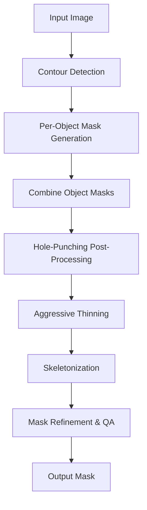

# Advanced Augmentation Guide

## Overview
This guide provides a comprehensive, professional overview of the advanced augmentation pipeline implemented in the BongardSolver project. The pipeline is designed for robust, research-grade mask generation and geometric data augmentation, with a focus on classical computer vision techniques. All logic related to the Segment Anything Model (SAM) is fully disabled for efficiency and reproducibility.

---

## Table of Contents
1. [Introduction](#introduction)
2. [Folder and File Structure](#folder-and-file-structure)
3. [Augmentation Pipeline Logic](#augmentation-pipeline-logic)
    - [1. Object-by-Object Segmentation](#1-object-by-object-segmentation)
    - [2. Hole-Punching Post-Processing](#2-hole-punching-post-processing)
    - [3. Aggressive Thinning and Skeletonization](#3-aggressive-thinning-and-skeletonization)
    - [4. Mask Refinement and QA](#4-mask-refinement-and-qa)
4. [Running the Augmentation Process](#running-the-augmentation-process)
5. [Diagrams](#diagrams)
6. [Best Practices](#best-practices)
7. [Troubleshooting](#troubleshooting)

---

## Introduction
The BongardSolver augmentation pipeline is engineered for high-quality, topology-preserving mask generation and geometric data augmentation. It leverages advanced classical vision techniques, including contour analysis, morphological operations, skeletonization, and robust post-processing. The pipeline is modular, extensible, and optimized for both speed and accuracy. All deep learning-based segmentation (SAM) is disabled for maximum efficiency and reproducibility.

---

## Folder and File Structure

```
BongordSolver/
├── ADVANCED_AUGMENTATION_GUIDE.md      # This guide
├── scripts/
│   └── image_augmentor.py              # CLI entry point for augmentation
├── data/
│   ├── derived_labels.json             # Input: image metadata/labels
│   ├── augmented.pkl                   # Output: augmented masks
│   └── ...
├── src/
│   ├── bongard_augmentor/
│   │   ├── hybrid.py                   # Main augmentation pipeline logic
│   │   ├── prompting.py                # Prompt generation (classical only)
│   │   ├── refiners.py                 # Mask refinement and QA
│   │   └── ...
│   └── ...
└── ...
```

---

## Augmentation Pipeline Logic

### 1. Object-by-Object Segmentation
- **Contour Detection:**
  - The pipeline detects all outer contours (objects) in each input image using classical edge and contour detection.
- **Per-Object Mask Generation:**
  - For each detected object, a binary mask is generated using adaptive thresholding, morphological cleaning, and contour filtering.
- **Topology-Aware Processing:**
  - The pipeline is designed to preserve object topology, including holes and nested structures, by analyzing contour hierarchies and applying negative mask logic for holes.

### 2. Hole-Punching Post-Processing
- After all object masks are combined, the pipeline re-analyzes the image for holes (internal contours).
- Detected holes are subtracted from the final mask, ensuring that empty spaces within objects are preserved ("hole-punching").

### 3. Aggressive Thinning and Skeletonization
- **Aggressive Thinning:**
  - Before skeletonization, the mask undergoes aggressive thinning (using erosion and thinning operations) to break down dense regions and highlight structural features.
- **Skeletonization:**
  - The thinned mask is skeletonized to extract the main structural lines, which are used for further refinement and QA.

### 4. Mask Refinement and QA
- **Morphological Cleaning:**
  - The mask is cleaned using opening and closing operations to remove noise and fill small gaps.
- **Contour-Based Simplification:**
  - Contours are simplified and small components are filtered out.
- **Quality Assurance:**
  - The pipeline includes robust QA checks (fill ratio, edge overlap, SSIM, Dice coefficient) to ensure mask quality.
- **Fallback Logic:**
  - If the initial mask fails QA, a robust fallback stack (edge-based, contour-based) is used to generate a valid mask.

---

## Running the Augmentation Process

To run the augmentation pipeline, use the following command:

```bash
python scripts/image_augmentor.py --input data/derived_labels.json --out data/augmented.pkl --batch-size 8 --type geometric
```

- `--input`: Path to the input JSON file with image metadata/labels.
- `--out`: Path to the output pickle file for augmented masks.
- `--batch-size`: Number of images to process in parallel.
- `--type`: Augmentation type (e.g., `geometric`).

---

## Diagrams

### Augmentation Pipeline Flow



---

## Best Practices
- **Classical-First Approach:**
  - The pipeline is optimized for classical computer vision; no deep learning models are used for segmentation.
- **Topology Preservation:**
  - Always preserve holes and nested structures using contour hierarchy analysis and hole-punching.
- **Aggressive Preprocessing:**
  - Use aggressive thinning and morphological operations to ensure robust skeletonization and mask quality.
- **Batch Processing:**
  - Adjust `--batch-size` based on available RAM for optimal performance.
- **Quality Assurance:**
  - Leverage built-in QA metrics to validate mask quality and trigger fallback logic if needed.

---

## Troubleshooting
- **Masks Are Too Large/Small:**
  - Tune thresholding and morphological parameters in `hybrid.py`.
- **Holes Not Preserved:**
  - Ensure hole-punching logic is active and contour hierarchy is correctly analyzed.
- **Performance Issues:**
  - Increase batch size only if sufficient RAM is available; otherwise, reduce batch size.
- **No Output Masks:**
  - Check input paths and ensure images are accessible and correctly referenced in `derived_labels.json`.

---

## Notes
- **SAM (Segment Anything Model) is fully disabled in this pipeline.** All mask generation and refinement is performed using classical computer vision techniques for maximum efficiency and reproducibility.

---

For further details, see the code in `src/bongard_augmentor/hybrid.py`, `refiners.py`, and `prompting.py`.
