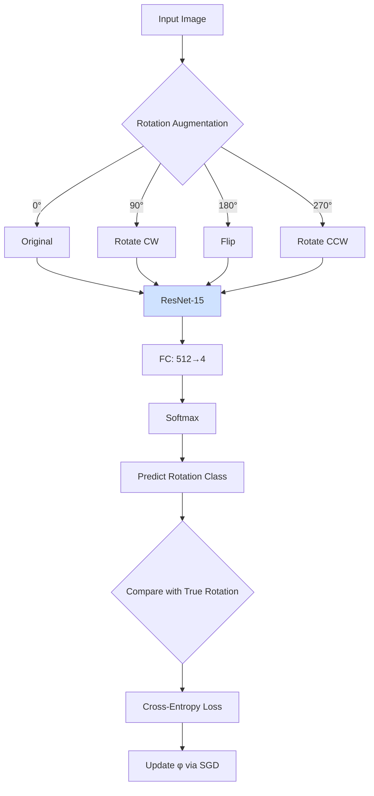
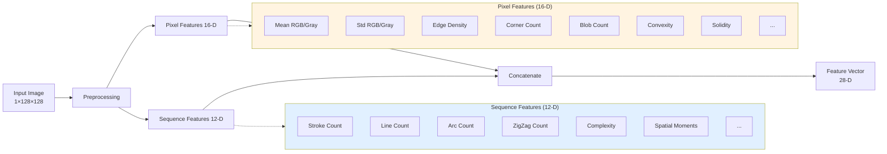
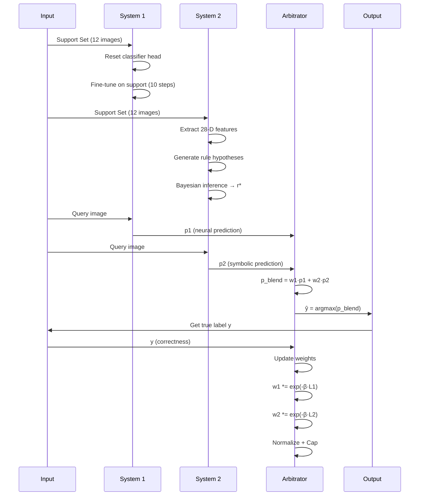

# Architecture Documentation

## System Overview

The Hybrid Dual-System Solver integrates two complementary cognitive processes:
- **System 1 (Neural)**: Fast pattern recognition via deep convolutional networks
- **System 2 (Bayesian)**: Deliberate rule induction via probabilistic inference

This document provides detailed architectural specifications, dataflow diagrams, and implementation details.

---

## High-Level Architecture

```mermaid
flowchart TB
    subgraph Input[" INPUT LAYER "]
        A[Support Set<br/>6 Pos + 6 Neg]
        B[Query Image]
    end
    
    subgraph Preprocess[" PREPROCESSING "]
        C[Image Augmentation]
        D[Normalization]
        E[Feature Extraction 28-D]
    end
    
    subgraph S1[" SYSTEM 1: NEURAL "]
        F[ResNet Backbone<br/>frozen, pretrained]
        G[FC Head<br/>resetable, task-specific]
        H[Softmax + Confidence]
    end
    
    subgraph S2[" SYSTEM 2: BAYESIAN "]
        I[Rule Generator<br/>primitives + compositions]
        J[Bayesian Scoring<br/>P(rule|data)]
        K[MAP Rule Selection]
    end
    
    subgraph Arbitrate[" META-ARBITRATION "]
        L[Weight Update<br/>exp(-β·loss)]
        M[Normalization]
        N[Cap Constraint<br/>max_w2 = 0.95]
        O[Weighted Blend]
    end
    
    subgraph Output[" OUTPUT "]
        P[Prediction: Pos/Neg]
        Q[Confidence Score]
    end
    
    A --> C
    B --> C
    C --> D
    
    D --> F
    D --> E
    
    F --> G
    G --> H
    
    E --> I
    I --> J
    J --> K
    
    H --> L
    K --> L
    
    L --> M
    M --> N
    N --> O
    
    O --> P
    O --> Q
    
    style S1 fill:#e1f5ff,stroke:#0066cc,stroke-width:2px
    style S2 fill:#fff4e1,stroke:#cc6600,stroke-width:2px
    style Arbitrate fill:#f0e1ff,stroke:#6600cc,stroke-width:2px
    style Input fill:#e8f5e9,stroke:#2e7d32,stroke-width:2px
    style Output fill:#ffe0e0,stroke:#c62828,stroke-width:2px
```

---

## System 1: Neural Pattern Recognition

### Architecture Diagram

```mermaid
flowchart LR
    subgraph Input
        A[Image 1×128×128]
    end
    
    subgraph Backbone["ResNet-15 Backbone (frozen φ)"]
        B[Conv1: 32 filters]
        C[ResBlock1: 32→64]
        D[ResBlock2: 64→128]
        E[ResBlock3: 128→256]
        F[ResBlock4: 256→512]
        G[Global AvgPool]
    end
    
    subgraph Head["Classifier Head (trainable ψ)"]
        H[FC1: 512→128<br/>ReLU + Dropout]
        I[FC2: 128→2<br/>logits]
    end
    
    subgraph Output
        J[Softmax]
        K[P_pos, P_neg]
        L[Confidence = max]
    end
    
    A --> B
    B --> C
    C --> D
    D --> E
    E --> F
    F --> G
    G --> H
    H --> I
    I --> J
    J --> K
    K --> L
    
    style Backbone fill:#cfe2ff,stroke:#0056b3
    style Head fill:#ffe5b4,stroke:#cc6600
```



### Layer Specifications

| Layer | Type | Input Shape | Output Shape | Parameters | Trainable |
|-------|------|-------------|--------------|------------|-----------|
| conv1 | Conv2d + BN + ReLU | 1×128×128 | 32×64×64 | 320 | ❌ (frozen) |
| resblock1 | ResidualBlock | 32×64×64 | 64×32×32 | 38,464 | ❌ (frozen) |
| resblock2 | ResidualBlock | 64×32×32 | 128×16×16 | 152,96 | ❌ (frozen) |
| resblock3 | ResidualBlock | 128×16×16 | 256×8×8 | 612,352 | ❌ (frozen) |
| resblock4 | ResidualBlock | 256×8×8 | 512×4×4 | 2,446,848 | ❌ (frozen) |
| avgpool | AdaptiveAvgPool2d | 512×4×4 | 512×1×1 | 0 | N/A |
| fc1 | Linear + ReLU | 512 | 128 | 65,664 | ✅ (reset each episode) |
| dropout | Dropout(0.5) | 128 | 128 | 0 | N/A |
| fc2 | Linear | 128 | 2 | 258 | ✅ (reset each episode) |

**Total Parameters**: ~3.3M (3.25M frozen, 66K trainable)

### Pretraining: Self-Supervised Rotation Prediction



**Training Details:**
- **Dataset**: 111,600 images (55,800 pos + 55,800 neg from train split)
- **Epochs**: 100
- **Batch Size**: 256
- **Optimizer**: SGD (lr=0.001, momentum=0.9, weight_decay=5e-4)
- **Augmentations**: {0°, 90°, 180°, 270°} rotations
- **Objective**: 4-way classification (rotation class)
- **Final Accuracy**: ~98.5% on rotation prediction

### Episodic Fine-Tuning

**CRITICAL BUG FIX**: Reset classifier head before each episode to prevent cross-task contamination.

```python
def fit(self, support_images, support_labels):
    # STEP 1: Reset head (prevent contamination)
    if self.freeze_backbone and self.using_pretrained:
        self.model.fc2.reset_parameters()  # Xavier init
    
    # STEP 2: Train on support set
    self.model.train()
    optimizer = torch.optim.SGD(
        self.model.fc2.parameters(),  # Only head
        lr=0.01, momentum=0.9
    )
    
    for epoch in range(10):  # 10 gradient steps
        logits = self.model(support_images)
        loss = F.cross_entropy(logits, support_labels)
        
        optimizer.zero_grad()
        loss.backward()
        optimizer.step()
    
    # STEP 3: Predict query
    self.model.eval()
    with torch.no_grad():
        query_logits = self.model(query_image)
        probs = F.softmax(query_logits, dim=1)
    
    return probs
```

---

## System 2: Bayesian Rule Induction

### Feature Extraction Pipeline



### Rule Hypothesis Space

**Primitive Rules:**
```
R_thresh(j, θ) := f_j ≥ θ
R_comp(i, j, θ) := (f_i - f_j) ≥ θ
```

**Compositional Rules:**
```
R_and := R1 ∧ R2 ∧ ... ∧ Rk
R_or := R1 ∨ R2 ∨ ... ∨ Rk
```

**Generation Process:**
1. **Primitive Pool**: Generate all threshold & comparison rules
   - Threshold: 28 features × 20 thresholds = 560 rules
   - Comparison: C(28,2) × 20 thresholds = 7,560 rules
   - Total: ~8,120 primitive rules

2. **Compositional Pool**: Top-k AND/OR combinations
   - Select top 50 primitives by likelihood
   - Generate 2-3 rule conjunctions/disjunctions
   - Total: ~2,500 compositional rules

3. **Search Space**: ~10,620 candidate rules

### Bayesian Inference

```mermaid
flowchart TB
    A[Support Set S<br/>6 pos + 6 neg] --> B[For each rule r in hypothesis space]
    
    B --> C{Evaluate r on S}
    
    C --> D[Compute Likelihood<br/>P(S|r)]
    D --> E[Compute Prior<br/>P(r)]
    E --> F[Compute Posterior<br/>P(r|S) ∝ P(S|r)·P(r)]
    
    F --> G[Accumulate all posteriors]
    G --> H[Select MAP rule<br/>r* = argmax P(r|S)]
    
    H --> I[Predict query<br/>P(y=1|r*, x_q)]
    
    I --> J[Confidence<br/>|P(y=1) - 0.5|×2]
    
    style C fill:#fff4e1
    style H fill:#ffe5b4
```

**Likelihood Model:**
$$
P(\mathcal{S} | r) = \prod_{i=1}^{12} \begin{cases}
1 - \epsilon & \text{if } r(\mathbf{x}_i) = y_i \\
\epsilon & \text{otherwise}
\end{cases}
$$

where $\epsilon = 0.01$ (noise rate).

**Prior Model (Occam's Razor):**
$$
P(r) \propto \exp(-\lambda \cdot \text{complexity}(r))
$$

where:
- Primitive rule: complexity = 1,
- k-conjunction: complexity = k
- λ = 0.1 (penalty weight)

**Posterior Computation:**
$$
P(r | \mathcal{S}) = \frac{P(\mathcal{S} | r) \cdot P(r)}{\sum_{r' \in \mathcal{R}} P(\mathcal{S} | r') \cdot P(r')}
$$

**MAP Estimate:**
$$
r^* = \arg\max_{r \in \mathcal{R}} P(r | \mathcal{S})
$$

---

## Meta-Learned Arbitration

### Weight Update Dynamics

```mermaid
flowchart TB
    subgraph Init
        A[w1 = 0.5, w2 = 0.5]
    end
    
    subgraph Episode
        B[S1 predicts p1]
        C[S2 predicts p2]
        D{Blend: p = w1·p1 + w2·p2}
        E[Predict: ŷ = argmax p]
        F{Compare with true y}
    end
    
    subgraph Update
        G[Compute L1 = CE(p1, y)]
        H[Compute L2 = CE(p2, y)]
        I[w1 *= exp(-β·L1)]
        J[w2 *= exp(-β·L2)]
    end
    
    subgraph Normalize
        K[w̃1 = w1/(w1+w2)]
        L[w̃2 = w2/(w1+w2)]
    end
    
    subgraph Cap
        M{w̃2 > max_w2?}
        N[w2_final = max_w2]
        O[w2_final = w̃2]
        P[w1_final = 1 - w2_final]
    end
    
    A --> B
    B --> D
    C --> D
    D --> E
    E --> F
    F --> G
    F --> H
    G --> I
    H --> J
    I --> K
    J --> L
    K --> M
    L --> M
    M -->|Yes| N
    M -->|No| O
    N --> P
    O --> P
    P --> B
    
    style Init fill:#e8f5e9
    style Update fill:#fff3e0
    style Cap fill:#f3e5f5
```

### Mathematical Formulation

**Update Rule:**
$$
w_i^{(t+1)} = w_i^{(t)} \cdot \exp\left(-\beta \cdot \mathcal{L}_{\text{CE}}(p_i^{(t)}, y^{(t)})\right)
$$

where:
$$
\mathcal{L}_{\text{CE}}(p, y) = -\left[y \log p + (1-y) \log(1-p)\right]
$$

**Normalization:**
$$
\tilde{w}_1 = \frac{w_1}{w_1 + w_2}, \quad \tilde{w}_2 = \frac{w_2}{w_1 + w_2}
$$

**Cap Constraint:**
$$
w_2^{\text{final}} = \min(\tilde{w}_2, w_{\max})
$$

$$
w_1^{\text{final}} = 1 - w_2^{\text{final}}
$$

**Final Prediction:**
$$
p_{\text{final}} = w_1^{\text{final}} \cdot p_1 + w_2^{\text{final}} \cdot p_2
$$

### Cap Selection (Auto-Cap)

```mermaid
flowchart LR
    A[Cap Grid<br/>{0.95, 0.97, 0.98, 0.99}] --> B{For each cap}
    
    B --> C[Run on val split<br/>200 episodes]
    C --> D[Measure accuracy]
    
    D --> E{All caps tested?}
    E -->|No| B
    E -->|Yes| F[Select best cap<br/>argmax accuracy]
    
    F --> G[Use on test splits]
    
    style F fill:#ffe5b4,stroke:#cc6600,stroke-width:2px
```

**Per-Split Tuning (Optional):**
- test_ff → validate on val(category=ff) → select cap_ff
- test_bd → validate on val(category=bd) → select cap_bd
- test_hd → validate on val(category=hd) → select cap_hd

**Note**: Per-split tuning should be labeled as "val-tuned per split" (not directly comparable to paper baselines).

---

## Data Flow

### Single Episode Execution



---

## Implementation Details

### Directory Structure

```
bayes_dual_system/
├── __init__.py                  # Package exports
├── types.py                     # Data structures (EpisodeData, ExampleItem)
├── data.py                      # Dataset loading
├── features.py                  # 28-D feature extraction
├── system1_nn.py                # Neural System 1
│   ├── SmallCNN                 # ResNet-15 architecture
│   └── NeuralSystem1            # Wrapper with SSL pretraining
├── system2_bayes_image.py       # Bayesian System 2
│   ├── extract_image_features   # 28-D extraction
│   ├── generate_rules           # Hypothesis space
│   └── BayesianSystem2Image     # Bayesian inference
└── dual_system_hybrid.py        # Arbitration
    └── HybridDualSystemSolver   # Main solver
```

### Key Classes

**NeuralSystem1:**
```python
class NeuralSystem1:
    def __init__(self, image_size=128, use_pretrain=True):
        self.model = SmallCNN(num_classes=2)
        if use_pretrain:
            self.load_pretrained_backbone()
            self.freeze_backbone()
    
    def pretrain_ssl_rotation(self, train_images, epochs=100):
        # 4-way rotation prediction task
        pass
    
    def fit(self, support_set):
        # Reset head + fine-tune on support
        self.model.fc2.reset_parameters()
        ...
    
    def predict(self, query_image):
        # Forward pass + softmax
        return prob_pos, confidence
```

**BayesianSystem2Image:**
```python
class BayesianSystem2Image:
    def __init__(self, image_size=128):
        self.image_size = image_size
        self.rules = []
    
    def fit(self, support_set):
        # Extract features
        features_pos = [extract_image_features(img) for img in support_pos]
        features_neg = [extract_image_features(img) for img in support_neg]
        
        # Generate rules
        self.rules = generate_all_rules(features_pos + features_neg)
        
        # Bayesian inference
        posteriors = compute_posteriors(self.rules, support_set)
        self.best_rule = max(posteriors, key=lambda r: posteriors[r])
    
    def predict(self, query_image):
        features = extract_image_features(query_image)
        satisfied = self.best_rule.evaluate(features)
        prob_pos = 0.99 if satisfied else 0.01
        return prob_pos, confidence
```

**HybridDualSystemSolver:**
```python
class HybridDualSystemSolver:
    def __init__(self, max_system2_weight=0.995):
        self.system1 = NeuralSystem1(use_pretrain=True)
        self.system2 = BayesianSystem2Image()
        self.system1_weight = 0.5
        self.system2_weight = 0.5
        self.max_system2_weight = max_system2_weight
    
    def solve_episode(self, episode_data):
        # Fit both systems
        self.system1.fit(episode_data.support)
        self.system2.fit(episode_data.support)
        
        # Predict query
        p1, conf1 = self.system1.predict(episode_data.query)
        p2, conf2 = self.system2.predict(episode_data.query)
        
        # Blend predictions
        p_blend = self.system1_weight * p1 + self.system2_weight * p2
        prediction = 1 if p_blend > 0.5 else 0
        
        # Update weights
        self.update_weights(p1, p2, episode_data.query_label)
        
        return prediction
    
    def update_weights(self, p1, p2, y_true):
        loss1 = binary_cross_entropy(p1, y_true)
        loss2 = binary_cross_entropy(p2, y_true)
        
        self.system1_weight *= np.exp(-2.0 * loss1)
        self.system2_weight *= np.exp(-2.0 * loss2)
        
        # Normalize
        total = self.system1_weight + self.system2_weight
        self.system1_weight /= total
        self.system2_weight /= total
        
        # Cap constraint
        if self.system2_weight > self.max_system2_weight:
            self.system2_weight = self.max_system2_weight
            self.system1_weight = 1.0 - self.max_system2_weight
```

---

## Performance Optimization

### GPU Acceleration

- **ResNet backbone**: CUDA-accelerated convolutions
- **Batch processing**: Support set processed in single forward pass
- **Mixed precision**: FP16 for memory efficiency (optional)

### Memory Management

- **Frozen backbone**: No gradient storage for 3.25M parameters
- **Head-only training**: Only 66K parameters updated
- **Rule caching**: Reuse generated rules across episodes (if features static)

### Computational Complexity

| Component | Time Complexity | Space Complexity |
|-----------|-----------------|------------------|
| S1 Forward Pass | O(n) | O(1) |
| S1 Fine-Tuning | O(10 × n × batch) | O(66K) |
| S2 Feature Extraction | O(n × d) | O(d) |
| S2 Rule Generation | O(d² × k) | O(d² × k) |
| S2 Bayesian Inference | O(R × n) | O(R) |
| Arbitration | O(1) | O(1) |

where:
- n = image size (128×128 = 16,384 pixels)
- d = feature dimension (28)
- k = threshold bins (20)
- R = rule count (~10,620)

**Total per Episode**: ~0.52 seconds on RTX 3050 Ti

---

## Extensibility

### Adding New Systems

To integrate a third system (e.g., program synthesis):

```python
class ProgramSynthesisSystem:
    def fit(self, support_set):
        # Infer action programs
        pass
    
    def predict(self, query_image):
        # Evaluate program match
        return prob_pos, confidence

# Extend arbitrator
class TripleSystemSolver(HybridDualSystemSolver):
    def __init__(self):
        super().__init__()
        self.system3 = ProgramSynthesisSystem()
        self.system3_weight = 0.33
    
    def solve_episode(self, episode_data):
        p1, _ = self.system1.predict(...)
        p2, _ = self.system2.predict(...)
        p3, _ = self.system3.predict(...)
        
        p_blend = (self.system1_weight * p1 +
                   self.system2_weight * p2 +
                   self.system3_weight * p3)
        
        # Update 3 weights
        ...
```

### Custom Arbitration Strategies

```python
class ConflictGatingArbitrator:
    """Use S2 only when S1 is uncertain"""
    def blend(self, p1, p2, conf1, conf2):
        if conf1 < 0.6:  # S1 uncertain
            return p2
        else:
            return p1

class ConfidenceWeightedArbitrator:
    """Weight by confidence instead of correctness"""
    def blend(self, p1, p2, conf1, conf2):
        w1 = conf1 / (conf1 + conf2)
        w2 = conf2 / (conf1 + conf2)
        return w1 * p1 + w2 * p2
```

---

## Debugging & Monitoring

### Logging Levels

- **DEBUG**: Weight trajectories, rule details, per-query predictions
- **INFO**: Episode summaries, split results, timing
- **WARN**: Weight saturation warnings, convergence issues

### Metrics Tracked

Per episode:
- `system1_correct`, `system2_correct`, `final_correct`
- `system1_weight`, `system2_weight`
- `system1_margin`, `system2_margin`
- `conflict` (S1 ≠ S2)
- `s2_corrected_s1` (S2 fixed S1's mistake)

Aggregated:
- `concept_accuracy`
- `avg_w1`, `avg_w2`
- `avg_p1_margin`, `avg_p2_margin`
- `tie_rate`
- `s2_usage_rate`

### Visualization

```python
import matplotlib.pyplot as plt

# Weight trajectory
plt.plot(weights_s1, label='S1')
plt.plot(weights_s2, label='S2')
plt.axhline(y=0.95, color='r', linestyle='--', label='Cap')
plt.legend()
plt.title('Weight Evolution Across Episodes')
plt.show()

# Performance by split
splits = ['test_ff', 'test_bd', 'test_hd_comb', 'test_hd_novel']
accuracies = [100.0, 92.7, 73.0, 73.4]
plt.bar(splits, accuracies)
plt.axhline(y=90.7, color='g', linestyle='--', label='Human')
plt.ylim([0, 105])
plt.ylabel('Accuracy (%)')
plt.title('Performance by Split')
plt.legend()
plt.show()
```

---

## References

**Architecture Inspirations:**
1. ResNet: He et al. (2016) - Deep Residual Learning for Image Recognition
2. MoCo: He et al. (2020) - Momentum Contrast for Unsupervised Visual Representation Learning
3. Meta-Baseline: Chen et al. (2020) - A New Meta-Baseline for Few-Shot Learning
4. Bayesian Program Learning: Lake et al. (2015) - Human-level Concept Learning through Probabilistic Program Induction

**Dual-Process Theory:**
5. Kahneman (2011) - Thinking, Fast and Slow
6. Evans & Stanovich (2013) - Dual-Process Theories of Higher Cognition

**BONGARD-LOGO Benchmark:**
7. Nie et al. (2020) - Bongard-LOGO: A New Benchmark for Human-Level Concept Learning and Reasoning
