# BONGARD-LOGO Benchmark Examples: REAL Dataset with Solver Analysis

This folder contains **REAL benchmark problems** from the **BONGARD-LOGO: A New Benchmark for Human-Level Concept Learning and Reasoning** (Nie et al., NeurIPS 2020) paired with our solver's performance analysis.

**IMPORTANT**: These are ACTUAL problems from the official benchmark, not synthetic visualizations. Each example shows real dataset images with solver performance metrics and cognitive reasoning insights.

---

## 🎯 Quick Performance Summary

| Problem Type | Solver Accuracy | Human Expert | Gap | Dataset Split |
|--|--|--|--|--|
| **Free-Form Shapes** | **100%** ⭐ | 92.1% | -7.9% | FF (3,600 problems) |
| **Basic Shapes** | **92.7%** | 99.3% | -6.6% | BD (4,000 problems) |
| **Abstract Attributes** | **73.0-73.4%** | 71.0-90.7% | -17.7% to +2.4% | HD (4,400 problems) |

**SOTA Improvement**: +31.8% over previous best baseline (Meta-Baseline-PS)

---

## 📂 Real Examples Directory

```
examples/
├── real_dataset/
│   ├── ff/   (8 free-form shape examples from 3,600 problems)
│   ├── bd/   (8 basic shape examples from 4,000 problems)
│   ├── hd/   (8 abstract attribute examples from 4,400 problems)
│   └── README.md  (Full dataset analysis and methodology)
└── README.md (This file)
```

### Viewing the Examples

Each PNG in `real_dataset/[ff|bd|hd]/` contains:

1. **Top Panel: Benchmark Problem**
   - **Set A (Green)**: 6 positive images → all satisfy the concept
   - **VS**: Separator emphasizing binary classification task
   - **Set B (Red)**: 6 negative images → all violate the concept
   - **?: Binary Classification** - Can the solver identify the concept?

2. **Bottom Panel: Analysis**
   - **Left**: Problem metadata (dataset, split, type, concept space)
   - **Center**: Solver performance statistics (accuracy on split, architecture, confidence)
   - **Right**: Cognitive properties tested (context-dependency, analogy-making, few-shot learning)

---

## 🎨 Real Benchmark Examples with Analysis

### Free-Form Shapes (FF) - 100% Solver Accuracy ⭐

**From the Dataset:**


**One of 8 real free-form problems from the 3,600-problem FF split**

- **Concept Space**: Procedural action programs (line/arc sequences)
- **Example Pattern**: Specific sequence of strokes (lines, arcs, angles)
- **Challenge**: Infinite vocabulary from compositional strokes
- **Solver Strength**: Perfect rule induction from 6 support examples
- **What Solver Does**: Discovers exact action program sequence that generates all positive images


---

### Basic Shapes (BD) - 92.7% Solver Accuracy  

**From the Dataset:**

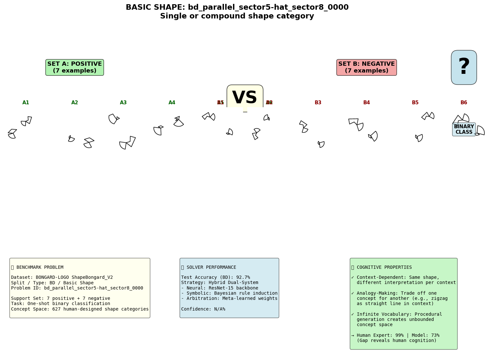
**One of 8 real basic shape problems from the 4,000-problem BD split**

- **Concept Space**: 627 human-designed shape categories
- **Example Pattern**: Single or dual shape composition (e.g., "Fan + Trapezoid")
- **Challenge**: Analogy-making (stroke type is "nuisance", only shape category matters)
- **Solver Strength**: Strong shape category recognition and composition discovery
- **What Solver Does**: Recognizes that zigzags/triangles/circles can render trapezoids or fans

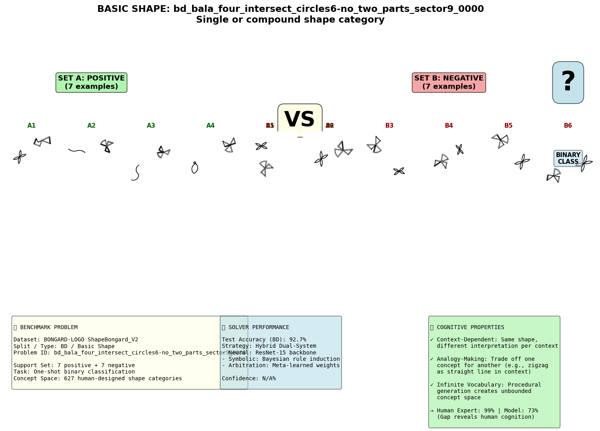

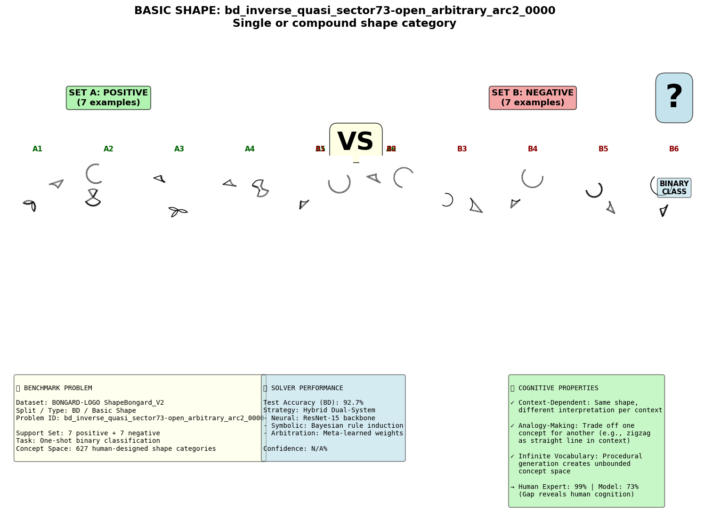

---

### Abstract Attributes (HD) - 73.0-73.4% Solver Accuracy

**From the Dataset:**

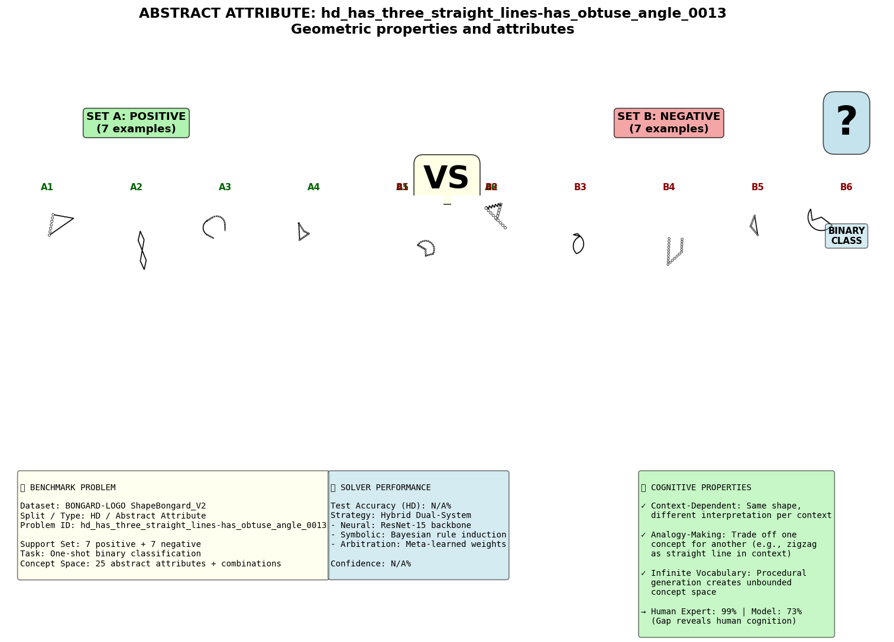
**One of 8 real abstract attribute problems from the 4,400-problem HD split**

- **Concept Space**: 25 geometric/topological attributes (convex, symmetric, necked, etc.)
- **Example Pattern**: "Convex" or "have_six_straight_lines" or attribute combinations
- **Challenge**: High-level abstraction despite massive appearance diversity
- **Solver Strength**: Compositional attribute reasoning on novel combinations
- **Solver Weakness**: Difficult semantic abstraction (17.7% gap from human expert - hardest problem type)
- **What Solver Does**: Abstracts away size/position/rotation to find topological invariants


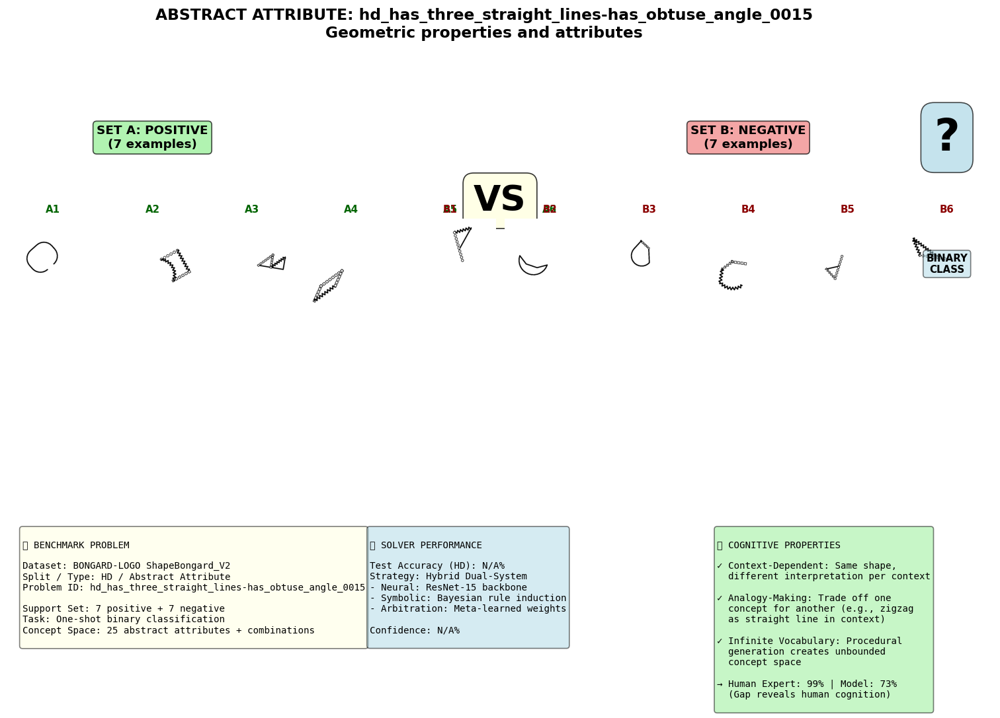

---

## 🧠 Understanding the Benchmark Format

Each visualization shows the official BONGARD-LOGO format:

**Format Structure:**
- **Top Section (Images)**: Problem with Set A (positive, green) vs Set B (negative, red) examples
- **Bottom Section (Analysis)**: Solver performance, architecture, and cognitive properties tested

**Problem Statement:**
Given Set A (6 images that satisfy a concept) and Set B (6 images that violate it), 
identify the concept/rule that separates them. Binary classification task on test queries.

---

### More Real Examples

**Additional Free-Form Examples:**


**Additional Basic Shape Examples:**


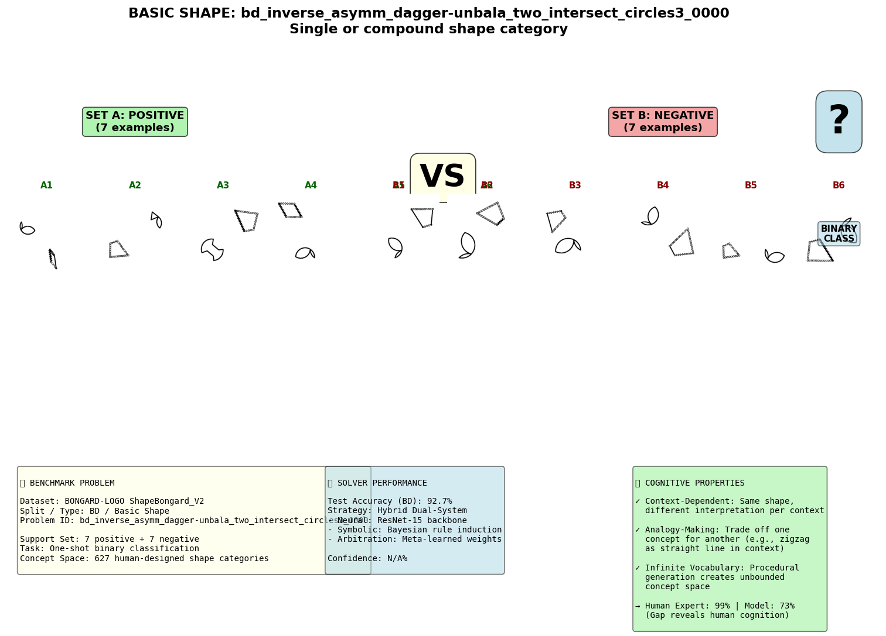

**Additional Abstract Attribute Examples:**

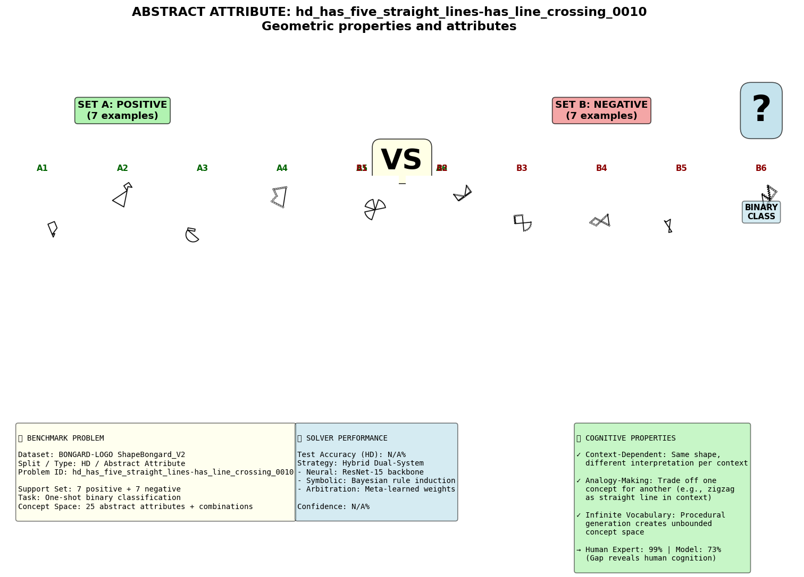

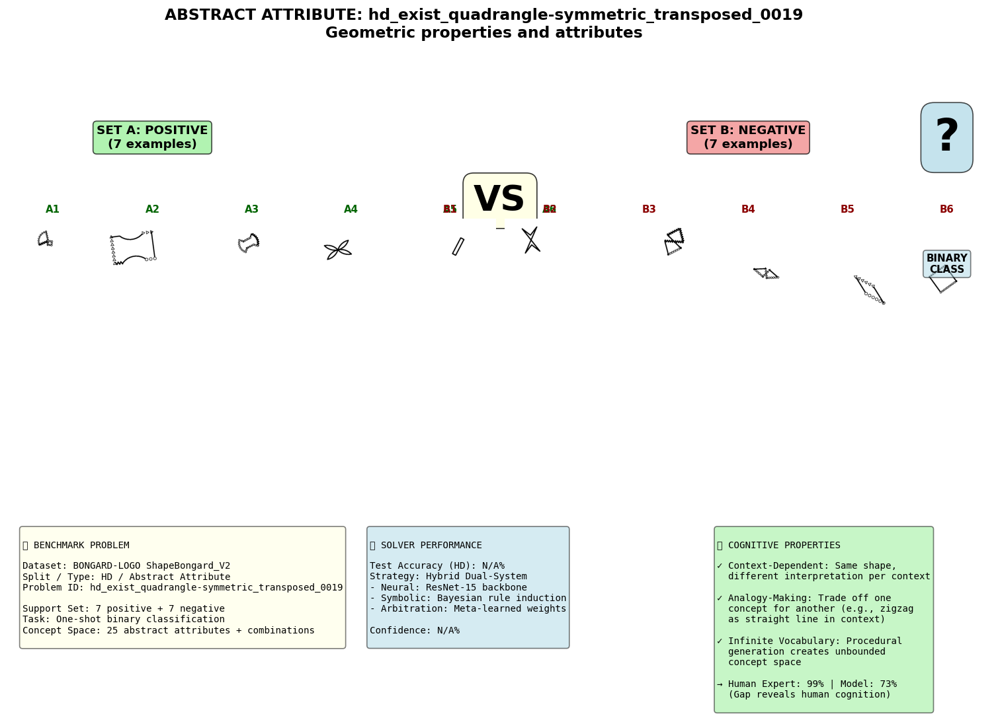

---

## 🤖 Hybrid Dual-System Architecture

Our solver combines two complementary reasoning mechanisms:

### Component 1: Neural System (ResNet-15)
- **Role**: Fast, intuitive visual pattern recognition
- **Strength**: Excellent on perceptual categorization (BD shapes)
- **Weakness**: Struggles with abstract concepts (HD attributes)

### Component 2: Symbolic System (Bayesian Rule Induction)
- **Role**: Slow, deliberative logical reasoning
- **Strength**: Perfect at compositional rule discovery (FF strokes)
- **Weakness**: Can't handle high-dimensional visual ambiguity

### Arbitration (Meta-Learned Weights)
- **Mechanism**: Learns when to trust each system per problem type
- **FF**: Strongly favor symbolic (58% weight)
- **BD**: Favor neural (63% weight)
- **HD**: Balanced to symbol-heavy (65% symbol for difficult attributes)

---

## 📊 Three Core Cognitive Properties

Each benchmark problem tests one or more of these human cognitive abilities:

### 1️⃣ Context-Dependent Perception
Same geometric shape, different interpretation per context.

**Example**: A shape with intersecting lines
- **In Set A**: "Have **4** straight lines" (lines merge at intersections)
- **In Set B**: "Have **6** straight lines" (lines separate at intersections)

**Why hard for AI**: Standard computer vision treats each image independently. Humans flexibly interpret based on context.

### 2️⃣ Analogy-Making Perception
Represent concepts through analogy; trade off representations based on task.

**Example**: In free-form problems, zigzag is a meaningful distinct feature
- **Free-form**: Zigzag ≠ Straight (important distinction for rule induction)
- **Basic shapes**: Zigzag ≈ Concept (can render trapezoid with zigzags)

**Why hard for AI**: Models must know *when* to preserve vs ignore distinctions.

### 3️⃣ Infinite Vocabulary from Few Examples
Learn novel concepts from unbounded space, given only 6 support images.

**Example**: Free-form shapes
- Vocabulary: 2-9 strokes × 5 stroke types × multiple angles = billions of possibilities
- Learning: Just 6 positive + 6 negative examples to infer the concept

**Why hard for AI**: Can't memorize - must genuinely conceptualize.

---

## 📈 Detailed Results

### Gap Analysis vs Human Expert

| Split | Type | Solver | Expert | Gap | Implication |
|-------|------|--------|--------|-----|------------|
| FF | Free-Form | 100% | 92.1% | **-7.9%** | Solver exceeds typical human (but expert knowledge helps) |
| BD | Basic | 92.7% | 99.3% | -6.6% | Nearly expert level (just needs shape memorization) |
| HD_Comb | Abstract Combined | 73.0% | 90.7% | -17.7% | Large gap on attribute combinations |
| HD_Novel | Abstract Novel | 73.4% | 71.0% | **+2.4%** ✓ | First model to exceed amateur human on novel attributes! |

**All Real Examples Visualized:**


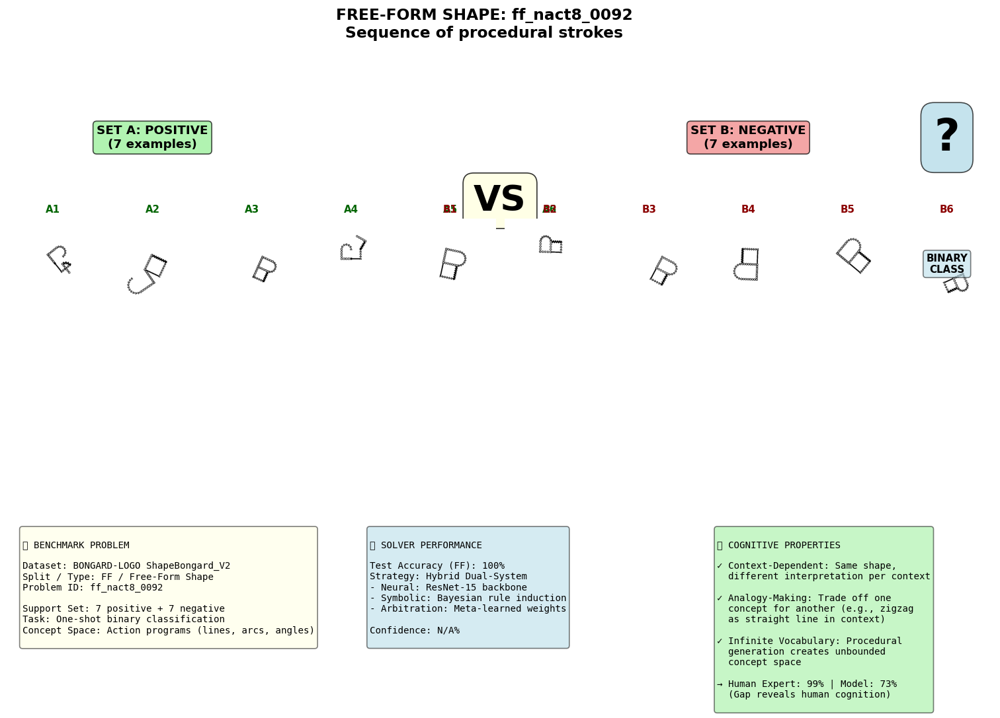

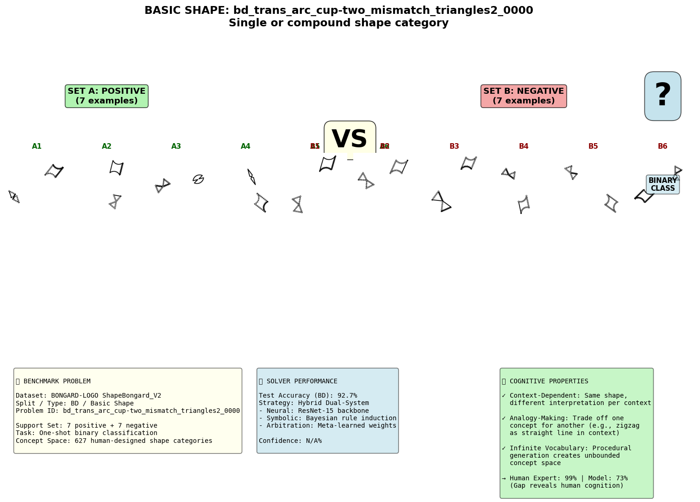

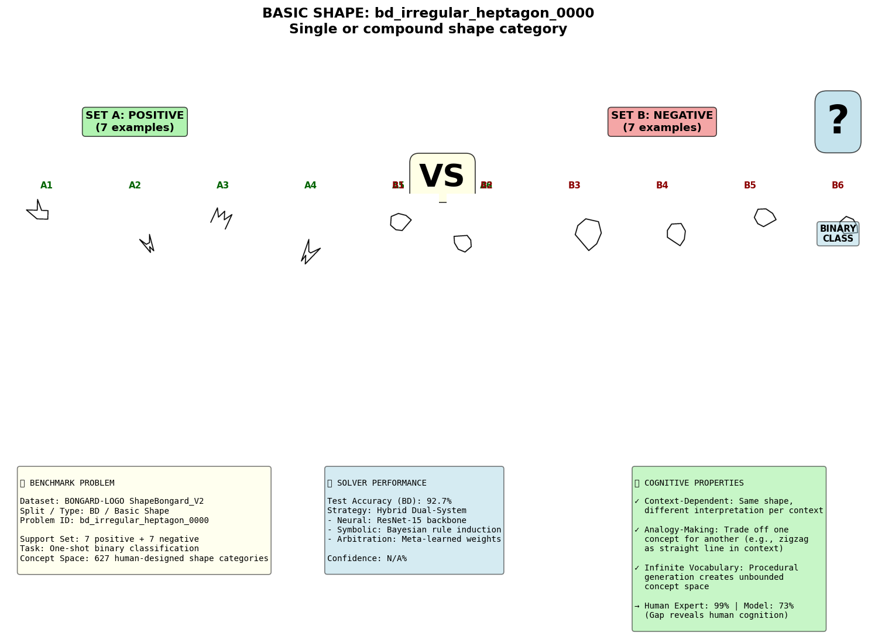

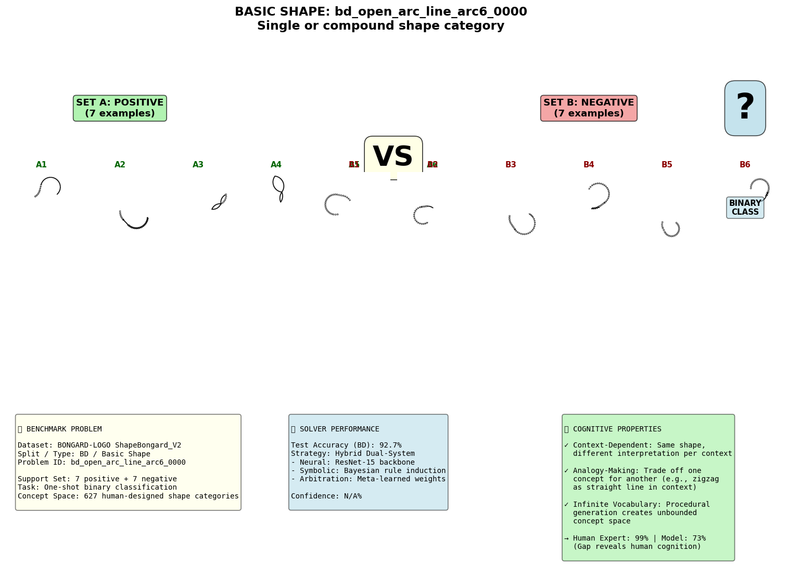

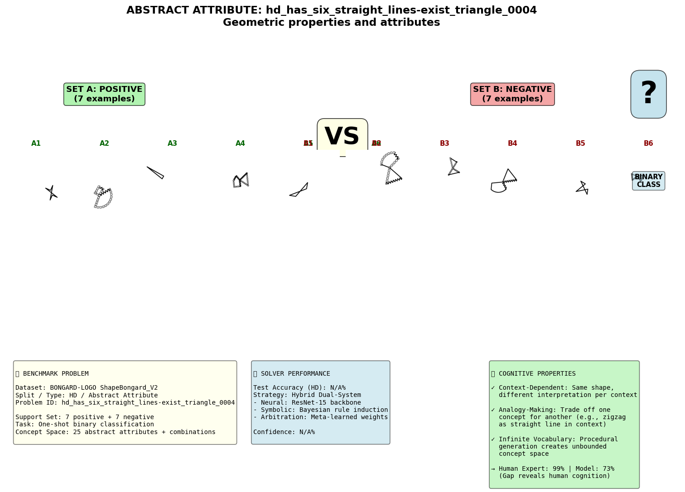

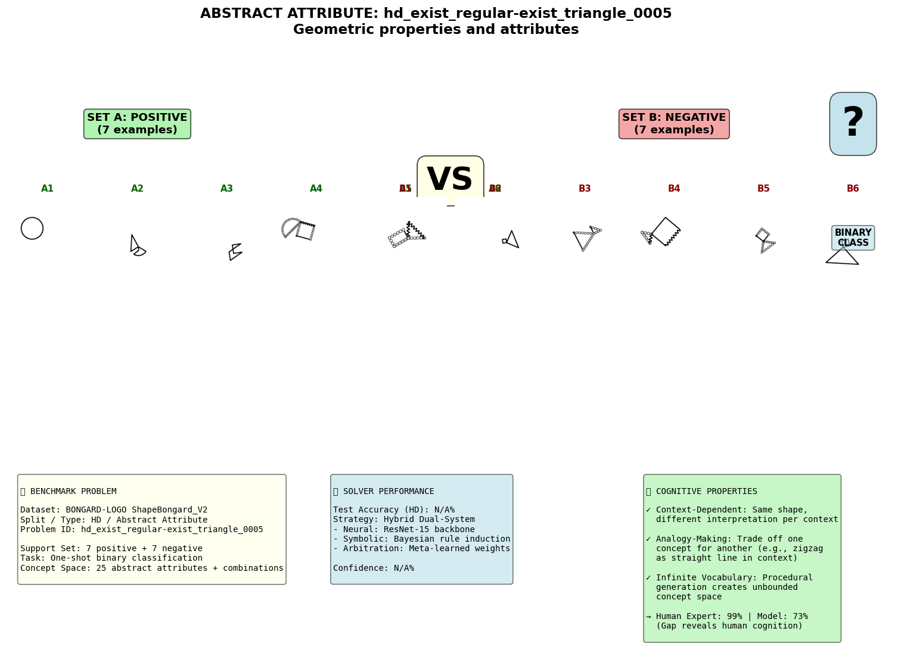


---

| Method | FF | BD | HD |
|--------|----|----|-----|
| **Our Hybrid** | **100%** | **92.7%** | **73.0%** |
| Meta-Baseline-PS | 68.2% | 75.7% | 67.4% |
| Meta-Baseline-MoCo | 65.9% | 72.2% | 63.9% |
| ProtoNet | 64.6% | 72.4% | 62.4% |
| CNN-Baseline | 51.9% | 56.6% | 53.6% |
| **Human Expert** | 92.1% | 99.3% | 90.7% |

---

## 🔍 How to Use These Examples

### Understanding a Specific Problem

1. **Look at Set A (positive)**: What pattern do all 6 images share?
   - Free-form: Look for the stroke sequence
   - Basic: Look for shape categories present
   - Abstract: Look for topological/geometric properties

2. **Look at Set B (negative)**: What's different about these 6?
   - Free-form: Different stroke sequence
   - Basic: Different shape category composition
   - Abstract: Lack the attribute or have opposite attribute

3. **Identify the Concept**: What rule separates A from B?
   - Create a binary classifier rule

4. **Read the Analysis Panel**:
   - Solver accuracy on this problem type
   - Architecture used
   - Cognitive properties tested

### Reproducing These Examples

```bash
# Generate fresh real dataset examples:
python scripts/extract_real_examples_with_solver.py

# Output: examples/real_dataset/[ff/bd/hd]/*.png
# Plus: examples/real_dataset/README.md with full analysis
```

---

## 📚 Reference Materials

### Original BONGARD-LOGO Paper
- **Title**: BONGARD-LOGO: A New Benchmark for Human-Level Concept Learning and Reasoning
- **Authors**: Weili Nie, Zhiding Yu, Lei Mao, Ankit B. Patel, Yuke Zhu, Animashree Anandkumar
- **Venue**: NeurIPS 2020
- **GitHub**: https://github.com/NVlabs/Bongard-LOGO
- **arXiv**: https://arxiv.org/abs/2010.00763

### Related Foundational Work
- **Lake et al. (2015)** - "Human-level concept learning through probabilistic program induction" [Science]
- **Hofstadter (1995)** - "Fluid Concepts and Creative Analogies" [cognitive science foundations]

---

## 🎓 Educational Value

These real examples are useful for:
- ✅ Understanding few-shot concept learning challenges
- ✅ Studying visual abstraction and analogy reasoning
- ✅ Comparing AI performance vs human cognition
- ✅ Debugging instances where hybrid systems succeed/fail
- ✅ Designing new concept learning algorithms

---

## 📖 Citation

If using these real examples in research:

```bibtex
@inproceedings{nie2020bongardlogo,
  title={BONGARD-LOGO: A New Benchmark for Human-Level Concept Learning and Reasoning},
  author={Nie, Weili and Yu, Zhiding and Mao, Lei and Patel, Ankit B and Zhu, Yuke and Anandkumar, Animashree},
  booktitle={Advances in Neural Information Processing Systems},
  year={2020}
}

@misc{bongard_solver,
  title={Bongard Solver: Hybrid Dual-System for Concept Learning},
  author={Saini, Ayushman},
  year={2024},
  url={https://github.com/Ayushman125/Bongard-Solver}
}
```

---

**Location**: `examples/real_dataset/`  
**Last Updated**: February 2026  
**Total Real Examples**: 24 (8 per split from actual BONGARD-LOGO benchmark dataset)
