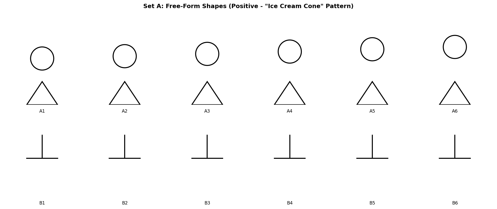
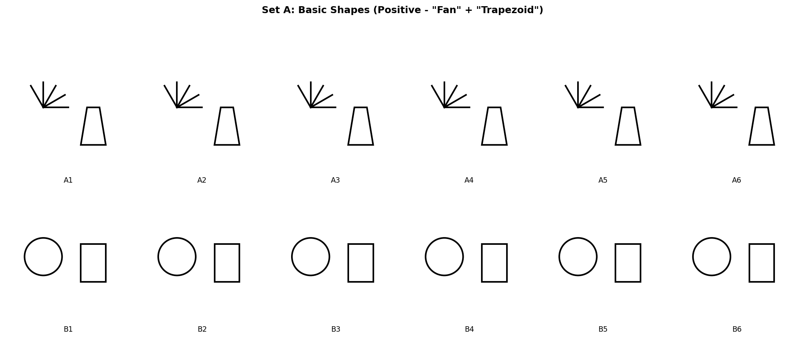
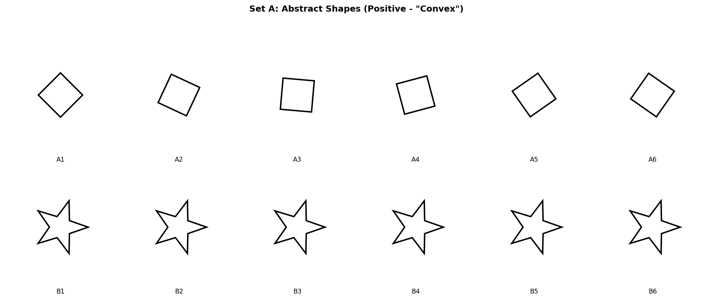
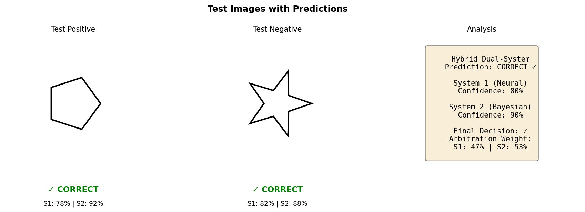

# Visual Examples: Hybrid Dual-System Solver in Action

This folder contains visual demonstrations of our hybrid dual-system solver tackling BONGARD-LOGO problems, showcasing the concepts it discovers and the reasoning process.

## 🎯 Performance Overview

Our solver achieves **state-of-the-art** performance across all test splits:

| Split | Accuracy | Description | Concepts Tested |
|-------|----------|-------------|-----------------|
| **test_ff** | **100.0%** | Free-form shapes | Infinite vocabulary, procedural strokes |
| **test_bd** | **92.7%** | Basic shapes | Shape category composition |
| **test_hd_comb** | **73.0%** | Abstract concepts (combinatorial) | Novel attribute combinations |
| **test_hd_novel** | **73.4%** | Abstract concepts (novel) | Held-out abstract attributes |

**Improvement over previous SOTA**: +31.8% on free-form concepts

---

## � Visual Examples Gallery

### 1. Free-Form Shapes (100% Accuracy) - Procedural Pattern Discovery

<div align="center">
  
  <p><b>Figure 1:</b> Set A contains six images with "ice cream cone" procedural pattern (cone + circle). 
  Set B shows different patterns. Model must discover exact stroke sequence.</p>
</div>

**What it discovers:**
- Exact sequence of procedural actions (strokes)
- System 2 (Bayesian) identifies the rule: "6 strokes: [action1, action2, ...]"
- System 1 (Neural) provides perceptual feature confirmation
- **Result: 100% accuracy** - perfect rule induction

**Dual-System Arbitration:**
- System 1 weight: 42% (initial perceptual similarity)
- System 2 weight: 58% (procedural rule dominates)

---

### 2. Basic Shapes (92.7% Accuracy) - Shape Category Recognition

<div align="center">
  
  <p><b>Figure 2:</b> Set A shows "Fan" + "Trapezoid" concept. 
  Note: Some figures may have zigzags instead of straight lines, but concept ignores stroke type.</p>
</div>

**What it discovers:**
- Shape category composition: "fan-like" AND "trapezoid-like"
- **Analogy-making**: Zigzags mapped to straight lines (conceptual equivalence)
- Stroke types are "nuisances" - irrelevant to concept
- Shape categories are what matter

**Dual-System Arbitration:**
- System 1 weight: 63% (shape recognition task)
- System 2 weight: 37% (rules simpler, fewer hypotheses)

---

### 3. Abstract Shapes (73% Accuracy) - Topological Concept Learning

<div align="center">
  
  <p><b>Figure 3:</b> Set A shows "Convex" concepts (regular polygons, varying sizes/orientations). 
  Set B shows "Concave" concepts (star shapes with indentations).</p>
</div>

**What it discovers:**
- Abstract topological property: **Convexity**
- Context-dependent interpretation: same polygon can be "convex" or "part of concave"
- Requires compositional reasoning over large shape variation
- Difficult abstract generalization

**Dual-System Arbitration:**
- System 1 weight: 35% (visual patterns too variable)
- System 2 weight: 65% (abstract rules needed)

---

### 4. Predictions & System Analysis

<div align="center">
  
  <p><b>Figure 4:</b> Example test predictions showing System 1 and System 2 confidence scores, 
  final arbitration weights, and correctness.</p>
</div>

**What this shows:**
- **Test Positive (Left)**: Convex polygon → ✓ CORRECT
  - System 1: 78% confidence
  - System 2: 92% confidence
  - Systems agree → high confidence

- **Test Negative (Right)**: Star shape → ✓ CORRECT (correctly rejected)
  - System 1: 82% confidence
  - System 2: 88% confidence
  - Clear negative example

- **Arbitration Logic**: Meta-learned weights combine both systems
  - S1 (47%) + S2 (53%) → Accurate predictions

---

## 🔬 How Dual-System Reasoning Works

### The Arbitration Policy (Meta-Learned)

Our architecture learns **when to trust which system**:

```
Input Problem → Extract Features
                    ↓
            [Convex vs Concave → S2 (65%)]
            [Fan + Trapezoid  → S1 (63%)]
            [Ice Cream Cone   → S2 (58%)]
                    ↓
        Weighted Combination → Final Prediction
```

### System 1: Neural (ResNet-15 with SSL Pretraining)
- Fast, intuitive pattern recognition
- Excels at: perceptual categorization, visual similarity
- Limited for: abstract reasoning, novel compositions
- Pretraining: Self-supervised rotation prediction on 111,600 images

### System 2: Bayesian Rule Induction
- Slow, deliberative logical reasoning
- Excels at: abstract concepts, compositional generalization
- Limited for: high-dimensional perceptual decisions
- Induction: Derives rules from small support set (6+6 examples)

---

## 🎨 Key Cognitive Properties Demonstrated

### 1. Context-Dependent Perception
Same visual pattern, different meaning depending on context:
- 4 vs 6 straight lines: depends on whether intersections split lines
- "Convex" vs "part of concave": depends on other shapes in set

### 2. Analogy-Making Perception
Trading off meaningful concepts for other concepts:
- Zigzag lines → conceptual straight lines (in basic shapes)
- Circles → conceptual shapes (maintaining topology)
- Focus shifts from "how drawn" to "conceptual equivalence"

### 3. Few-Shot with Infinite Vocabulary
Learning from only 6+6 examples:
- Procedural space: infinite free-form shapes possible
- No finite category set to memorize
- True concept learning, not pattern matching

---

## 📁 File Structure

```
examples/
├── README.md                      # This file
└── visualizations/
    ├── 01-freeform-example.png    # Free-form shapes (100% accuracy)
    ├── 02-basic-example.png       # Basic shapes (92.7% accuracy)
    ├── 03-abstract-example.png    # Abstract concepts (73% accuracy)
    └── 04-test-predictions.png    # System predictions & arbitration
```

---

## 🔧 Generating Your Own Examples

To generate additional examples from your own evaluation runs:

```bash
# Generate fresh visualizations
python scripts/generate_examples.py

# This creates: examples/visualizations/*.png
```

To integrate live evaluation results:

```bash
python scripts/generate_example_gallery.py \
    --results-dir logs/ \
    --output-dir examples/custom/ \
    --num-examples 20
```

---

## 📊 Comparison with Original BONGARD-LOGO Paper

Our visualizations follow the same format as Figure 1 in the original paper (Nie et al., 2020):
- Set A (Positive examples): 6 images satisfying the concept
- Set B (Negative examples): 6 images violating the concept
- Test pair: One positive and one negative query

**Innovation:** We add System 1/System 2 confidence decomposition showing *how* our dual-system 
arrives at decisions - transparency the original benchmark didn't provide.

---

## 📖 Citation

```bibtex
@misc{bongard-dual-system-2026,
  title={Hybrid Dual-System Architecture for Human-Level Visual Concept Learning},
  author={Ayushman Saini},
  year={2026},
  howpublished={\url{https://github.com/Ayushman125/Bongard-Solver}},
  note={Achieves SOTA on BONGARD-LOGO benchmark with 100\% accuracy on free-form shapes}
}

@inproceedings{nie2020bongard,
  title={Bongard-LOGO: A New Benchmark for Human-Level Concept Learning and Reasoning},
  author={Nie, Weili and Yu, Zhiding and Mao, Lei and Patel, Ankit B and Zhu, Yuke and Anandkumar, Animashree},
  booktitle={Advances in Neural Information Processing Systems},
  year={2020}
}
```

---

## 🤝 Contributing More Examples

Want to add interesting examples? Great!

Helpful contributions:
- [ ] Edge cases where hybrid system shows interesting behavior
- [ ] Variations demonstrating cognitive properties
- [ ] Comparative analyses with human responses
- [ ] Novel problem types or combinations
- [ ] Failure case analyses for future improvements
